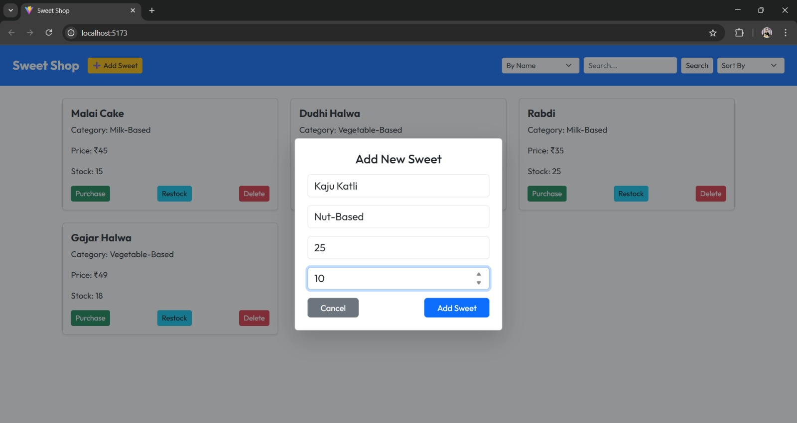
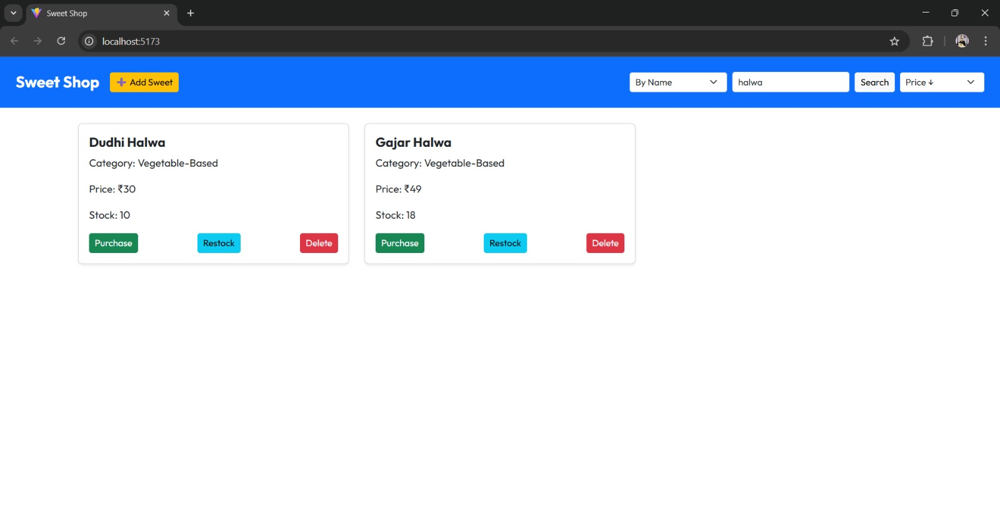
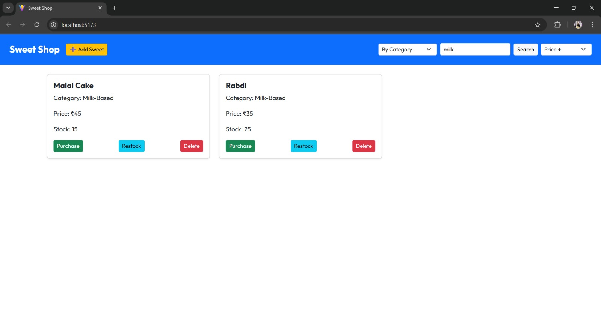
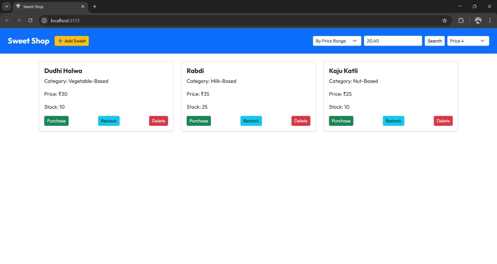
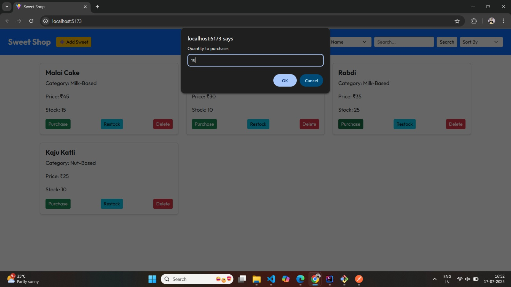
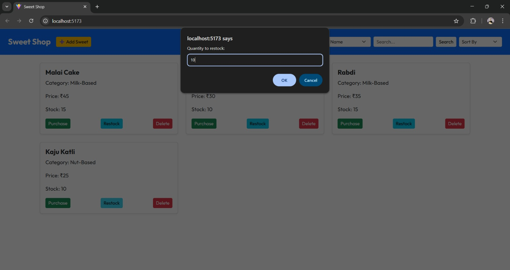

 # Sweet Shop Management System  

## Overview  

A full-stack Sweet Shop Management System built with **Java (Spring Boot)** for backend and **ReactJS** for frontend, developed using **Test-Driven Development (TDD)** approach using **JUnit 5**.  

## Key Features  

- Add, View, Delete Sweets  
- Search by Name, Category, or Price Range  
- Sort by Price or Quantity (Ascending & Descending)  
- Purchase & Restock with Stock Validation  
- Exception Handling with Custom Errors  
- Responsive, Clean, User-Friendly UI with Bootstrap  
- No Database Used — In-memory List Management  

## Project Structure  
```
/Backend  
 ├── src  
 │   ├── main  
 │   │   └── java  
 │   │       └── com.incubyte.sweetshop  
 │   │            ├── controller  
 │   │            ├── service  
 │   │            ├── model  
 │   │            └── customExceptions  
 │   └── test  
 │       └── java  
 │           └── com.incubyte.sweetshop.service  
 └── pom.xml  

/Frontend
└── src
└── package.json

README.md
```

## TDD Journey Highlights  

- Wrote failing tests first (Red)  
- Developed minimal code to pass tests (Green)  
- Refactored and improved code (Refactor) with 100% Coverage
- Handled tests with custom exceptions
- Wrote test cases for each method including edge cases  
- Maintained meaningful Git commits for each step  

## API Highlights  

- **Add Sweet:** `POST /sweetshop/api/sweet/add`  
- **Get All Sweets:** `GET /sweetshop/api/sweet/getAllSweets`  
- **Search, Sort, Purchase, Restock — Fully Functional APIs**  

## Technologies Used  

### Backend  
- Java 21  
- Spring Boot 3.5.3  
- JUnit 5  
- Maven  
- Custom Exceptions & Services  

### Frontend  
- ReactJS  
- Axios (for API calls)  
- Bootstrap 5  
- React Hot Toast (for user notifications)  

## How to Run  
### Backend  
```bash
cd Backend
mvn clean install
mvn spring-boot:run
```
Backend runs on: http://localhost:3000

### Backend  
```bash
cd Frontend
npm install
npm run dev
```
Frontend runs on: http://localhost:5173

## Screenshots Of Frontend

### Application Home Page  


### Add Sweet Modal  


### Sort Sweet By Quantity in Ascending Order  


### Search Sweet By Name  


### Search Sweet By Category  


### Sort Sweet By Price Range(Min,Max)  


### Delete Sweet Gajar Halwa


### Purchase Sweet Rabdi - Quantity(10)


### Restock Sweet Kaju Katli - Quantity(10)


- Rest of the Screenshots are attached in screenshots folder
## Author

Dino raj 
This project is built as part of the Incubyte TDD Kata Assessment.
